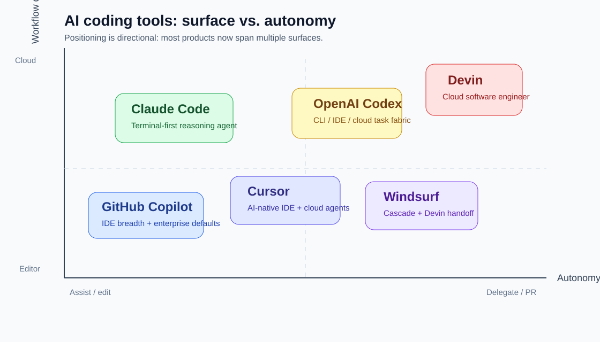
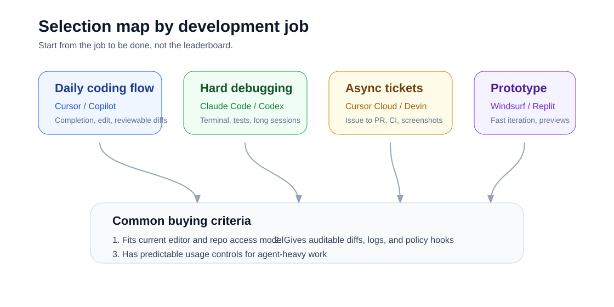

# AI 编程工具竞品研究

> 研究时间：2026-05-26  
> 研究假设：用户没有指定具体产品。本文将“竞品”界定为当前最相关的 AI 编程工具 / AI IDE 赛道，并以 Cursor 的竞争视角组织分析。若目标产品不是 Cursor，可把本文作为赛道扫描，再替换基准产品。

## 一、结论先行

AI 编程工具的竞争已经不再是“谁的补全更准”。2024 年前后的核心战场是 IDE 内补全和聊天，2025-2026 年的主线变成了代理化：工具要能读仓库、改多文件、运行命令、修 CI、开 PR，并把过程留下可审计的痕迹。一个开发者可能仍在编辑器里工作，但购买决策正在被“能不能把任务交出去”影响。

从 Cursor 视角看，直接竞品不是一个产品，而是三类工作流的合围。GitHub Copilot 依托 GitHub、VS Code、Visual Studio 和企业采购入口，吃掉“默认选择”；Claude Code 和 OpenAI Codex 吃掉“高推理、终端/云端代理”场景；Windsurf/Devin 把本地 IDE 与云端软件工程代理打通，试图在“从本地计划到云端交付”上形成闭环。

最重要的判断有四个：

1. **Cursor 的护城河是 AI-native IDE 体验与云端代理的连续性。** Cursor 官方定价页把 Agent、frontier models、MCP、skills、hooks、Cloud Agents 放在 Pro 及以上计划里；Cloud Agents 文档强调隔离 VM、多仓库、浏览器验证、PR 证据、GitHub Actions 自动修复和自动化触发。这说明 Cursor 不只卖编辑器，而是在卖“从本地会话到云端执行”的开发控制面。
2. **Copilot 的护城河是分发与企业默认项。** GitHub Blog 将 ask/edit/agent modes 拆成三种工作方式；Visual Studio / Copilot 页面显示其免费层、Pro、Business、Enterprise 与 IDE 覆盖。对大组织来说，Copilot 的强点不是最激进的代理能力，而是“已经在 GitHub 和 IDE 里、合规采购容易、员工迁移成本低”。
3. **Claude Code 与 Codex 正在把“模型能力”产品化为可编排代理。** Claude Code 官方文档把它定义为能读代码、编辑文件、运行命令、连接 MCP、使用 hooks、运行 agent teams 的工具；Codex 定价页则明确覆盖 web、CLI、IDE extension、iOS、云端代码审查与 Slack 集成，并提供按计划或 API 的使用方式。它们会不断侵蚀 IDE 的差异化，因为模型厂商正在直接拥有开发入口。
4. **Windsurf/Devin 的方向值得重视。** Windsurf 定价页展示 Cascade、Fast Context、premium models、Devin Cloud 与团队管理；Windsurf 文档显示可以在本地 Cascade 制定方案后一键交给 Devin 云端执行。Devin 的自助计划又把 Devin sessions、Devin CLI 和 Windsurf IDE 放进同一套日/周额度。这种“本地 IDE + 云端工程师”的组合，对 Cursor Cloud Agents 构成正面竞争。

## 二、市场分层：从工具到执行系统

AI 编程工具可以按“工作界面”和“自治程度”拆成四层。这个拆法比单纯按公司名单更有用，因为开发者买工具时不是在买品牌，而是在买一种工作流。

第一层是编辑器内辅助，典型代表是 GitHub Copilot 的补全、聊天和 edit mode。它的价值在低摩擦：不改变 IDE，不改变代码托管，不要求团队把任务交给云端代理。它更像开发者手边的“加速器”。

第二层是 AI-native IDE，Cursor 和 Windsurf 是主角。它们牺牲一部分“留在原 IDE”的便利，换来更深的上下文索引、多文件编辑、agent mode、规则、hooks、MCP 和专门为 AI 改造的交互。这个层级的关键不是补全，而是开发者能否在一个地方完成计划、修改、运行和审阅。

第三层是终端/本地代理，Claude Code、Codex CLI、Aider、Gemini CLI 等都在这里。它们更受高级开发者和平台团队欢迎，因为终端天然连接 repo、测试、构建、脚本和内部工具。缺点是可视化弱、成本更难预估、对提示和权限管理要求更高。

第四层是云端软件工程代理，Cursor Cloud Agents、Devin、Codex Cloud、GitHub Copilot cloud agent 都属于这个方向。它们的商业价值更接近“异步工程产能”：把 issue、Slack、Linear、GitHub 评论或定时任务转成 PR，并附带日志、截图、视频或 CI 结果。这个层级会直接影响团队的任务分配方式，因此对安全、审计、环境配置和成本控制要求最高。

## 三、核心竞品对比

| 产品 | 核心定位 | 强项 | 弱项 / 风险 | 典型买点 |
| --- | --- | --- | --- | --- |
| Cursor | AI-native IDE + Cloud Agents | 本地 IDE 体验、Agent、MCP/skills/hooks、云端 VM、多仓库、PR 证据、CI 自动修复 | 需要迁移到 Cursor IDE；重度 Agent 使用的成本可预测性需要管理 | 个人/团队把 AI 作为主力编程界面 |
| GitHub Copilot | GitHub/IDE 原生 AI 助手与代理 | 分发强、IDE 覆盖广、企业采购友好、代码审查与 GitHub 工作流天然结合 | 对深度 AI-native IDE 体验的控制有限；高级代理体验取决于宿主 IDE/平台 | 大组织默认配置、低迁移成本 |
| Claude Code | 终端优先的高推理编码代理 | 强推理、读写仓库、运行命令、MCP、hooks、agent teams | 无免费 Claude Code；终端门槛高；长会话成本与权限管理复杂 | 复杂调试、重构、架构探索 |
| OpenAI Codex | 跨 web/CLI/IDE/cloud 的编码代理 | ChatGPT 分发、Codex 专用模型、云端任务、代码审查、Slack/GitHub 集成、API 模式 | 计划/额度/credits 复杂；云端高级能力并非 API key 模式全覆盖 | 多入口代理工作流、ChatGPT 生态用户 |
| Windsurf | AI IDE + Cascade + Devin Cloud | 本地 Cascade、Fast Context、Devin 云端交接、团队/企业计划 | 产品方向受 Cognition/Devin 整合节奏影响；市场认知波动 | 快速原型、本地到云端委派 |
| Devin | 云端 AI 软件工程师 | 长任务、独立 VM、浏览器/桌面、Slack/Linear/MCP、团队协作、Review/DeepWiki | 复杂任务成功率仍需人审；云端环境配置与额度消耗是关键成本项 | 异步处理明确 ticket、迁移、批量维护 |

### Cursor

Cursor 的竞品位置很特殊：它既是 IDE，又在扩展为代理平台。官方定价页显示，Pro 计划提供扩展 Agent 限额、frontier models、MCP、skills、hooks 和 Cloud agents；Teams 进一步提供 shared team context、team-wide rules/skills/automations、Security review agent、SAML/OIDC、usage analytics 和 centralized billing。Cloud Agents 文档显示，代理运行在隔离云环境中，可以构建功能、修 bug、写测试、开 PR，并附带截图、视频和日志引用；它还支持多仓库、MCP、hooks、浏览器验证、Slack/GitHub/Linear/API 触发和 cron 自动化。

这意味着 Cursor 的竞争重点不是“编辑器 vs 插件”，而是能否把开发者日常意图变成可重复执行的工程流程。Cursor 的优势在连续体验：同一条对话可以从本地上下文移动到云端，团队规则、hooks、MCP 和环境配置都能成为代理执行的一部分。

风险也来自同一个方向。云端代理的价值越高，用户越会关注安全边界、环境可复现性、用量治理和结果审计。如果 Cursor 不能让团队清楚知道每次代理运行消耗了什么、触碰了什么、为什么这么改，Copilot、Codex、Devin 这些更贴近平台/模型厂商的竞品会有机会切入。

### GitHub Copilot

Copilot 的策略是让 AI 变成 GitHub 和 IDE 的默认能力。GitHub Blog 对 ask、edit、agent modes 的解释很清晰：ask mode 回答问题不改代码；edit mode 对指定文件产生 review-ready edits；agent mode 会自动规划、选择文件、运行工具/命令并迭代。这个三段式设计覆盖了从保守辅助到自治执行的信任梯度。

Copilot 的最大优势是分发和组织信任。它原生贴近 GitHub、Visual Studio、VS Code 和企业账号体系，个人层有免费/Pro/Pro+，组织层有 Business/Enterprise。对已经把代码、PR、Actions、权限和审计都放在 GitHub 上的团队来说，Copilot 经常不是“最强工具”的选择，而是“最容易批准并铺开”的选择。

它对 Cursor 的威胁在于默认入口。如果 Copilot 的 agent mode、cloud agent 和 code review 持续增强，很多团队未必愿意迁移到一个 VS Code fork。Cursor 必须证明“AI-native IDE + 云端代理”的效率增益足以覆盖迁移成本。

### Claude Code

Claude Code 代表的是另一种竞争：不争夺 IDE，而是争夺开发者真正执行任务的地方。官方文档把 Claude Code 定义为 agentic coding tool，可读代码库、编辑文件、运行命令并集成开发工具；它支持 terminal、IDE、desktop app 和 browser。它还把 MCP、CLAUDE.md、instructions、skills、hooks、background agents、agent teams 和 Agent SDK 组织成一套可定制能力。

Claude Code 对高级开发者有吸引力，是因为它不强迫迁移编辑器。对习惯终端、脚本、测试和内部平台的团队来说，CLI 代理可以自然嵌入已有 workflow。Claude Help Center 显示 Claude Code 可随 Pro/Max 使用，Max 5x 为每月 100 美元、Max 20x 为每月 200 美元，并且 Pro/Max 的 Claude 与 Claude Code 共用使用限制；如果使用 API key，则会按标准 API 费率计费。

Claude Code 的弱点是产品表面相对“工程师化”：新手不一定愿意在终端里授权代理读写文件和跑命令；团队层面要自己定义权限、成本监控和审计边界。但在复杂调试、架构理解和长会话推理上，它会持续给 Cursor 施压。

### OpenAI Codex

Codex 的竞争方式更像“模型厂商把编码代理做成多入口基础设施”。OpenAI 的 Codex 定价页覆盖 web、CLI、IDE extension、iOS、云端自动代码审查和 Slack 集成；也区分 ChatGPT 计划内使用、Pro 倍数额度、Business/Enterprise、安全控制、credits 和 API key 模式。Codex app 的发布信息强调可管理多个 agents、并行运行长期任务，并在 CLI、web、IDE extension、app 和 cloud 中复用。

这对 Cursor 的挑战在于入口扩张。OpenAI 不需要赢下某一个 IDE 才能触达开发者，ChatGPT、CLI、VS Code extension、GitHub review、Slack 都可以成为任务入口。它也更容易把最新 Codex 模型、credits 和 ChatGPT 组织能力打包销售。

Codex 的短板是价格与额度心智复杂。官方页面本身就需要解释不同计划的 local messages、cloud tasks、code reviews、credits、API key 与模型差异。对团队采购来说，这既是灵活性，也是理解成本。Cursor 若能提供更直观的“每类任务成本/成功率/审计证据”，会有机会在团队落地上更清晰。

### Windsurf 与 Devin

Windsurf 和 Devin 正在合并成本模型与工作流。Windsurf 定价页显示 Free、Pro 20 美元、Max 200 美元、Teams 40 美元/人/月和 Enterprise，并强调 Cascade、daily/weekly allowance、extra usage at API price、Fast Context、premium models 与 Devin Cloud。Windsurf 文档进一步说明，用户可以在本地 Cascade 中规划，然后一键交给 Devin；Devin 运行在云端 VM 中，可调试、部署、测试，关闭电脑后继续执行。

Devin 自助计划文档显示，Free、Pro 20 美元/月、Max 200 美元/月、Teams 80 美元/月最低消费；Pro/Max 的额度覆盖 Devin sessions、Devin CLI 和 Windsurf IDE，Teams 还提供 full seat / flex seat、共享 on-demand credits、Slack、Linear 和 MCP 集成。这说明 Cognition 不是把 Windsurf 和 Devin 当成两个割裂产品，而是要形成一套从本地代理到云端代理的统一消费模型。

它对 Cursor 的威胁非常直接。Cursor Cloud Agents 也是在解决“把任务交给云端”问题，而 Windsurf + Devin 的叙事更像“本地思考、云端执行、统一看板管理”。如果 Devin 的成功率和可控性提升，Cursor 需要在云端代理的开发者体验、PR 证据、CI 修复、多仓库和自动化触发上保持领先。

## 四、价格与商业模式观察

这个市场表面上是订阅制，实际已经进入“订阅 + 用量 + 高级模型/云资源”的混合模式。原因很简单：补全的边际成本可控，而长时间代理运行会消耗模型 token、VM、浏览器、测试环境和外部工具调用。

| 产品 | 入门价格信号 | 高用量价格信号 | 计费复杂度 |
| --- | --- | --- | --- |
| Cursor | Hobby 免费；Pro 20 美元/月；Teams 40 美元/人/月 | Pro+/Ultra；Cloud Agents 按所选模型 API 价格 | 中：订阅 + model usage + on-demand |
| GitHub Copilot | Free；Pro 10 美元/月；Business 19 美元/人/月；Enterprise 39 美元/人/月 | Pro+ 39 美元/月与 premium requests | 中低：企业采购认知成熟 |
| Claude Code | Pro 20 美元/月可用；Max 100/200 美元/月 | API key 按标准 API 费率；Team/Enterprise 另计 | 中高：共享 Claude 使用限制与 API 模式容易混淆 |
| OpenAI Codex | 随 ChatGPT 计划；Plus/Pro/Business/Enterprise | credits、Pro 倍数额度、API key token 计费 | 高：入口、模型、credits、云端能力组合多 |
| Windsurf | Free；Pro 20 美元/月；Teams 40 美元/人/月 | Max 200 美元/月；extra usage at API price | 中：日/周额度 + 额外用量 |
| Devin | Free；Pro 20 美元/月；Teams 80 美元/月最低 | Max 200 美元/月；Teams credits；全员/flex seat | 中高：额度跨 Devin/Windsurf/CLI，团队 seat 模型较新 |

价格战不会只发生在月费上。Copilot 以低价和企业打包形成压力，Cursor 和 Windsurf 以 20 美元个人 Pro 作为锚点，Claude Code 和 Codex 则通过高阶模型与代理能力引导重度用户进入 100-200 美元/月或 credits/API 模式。真正的商业差异会落在三个指标上：单个任务完成成本、可接受的人审成本、以及因代理引入 bug 或安全问题造成的返工成本。

## 五、选型路径与机会判断

如果购买者是个人开发者，选择通常由工作习惯决定。习惯编辑器内迭代、需要好用的多文件改动，Cursor 仍然是很强的默认选项；已经深度使用 GitHub 和 VS Code，且预算敏感，Copilot 更容易成为第一选择；习惯终端、愿意为复杂调试和重构付费，Claude Code 或 Codex CLI 更有吸引力。

如果购买者是小团队，核心问题不是哪一个模型最强，而是能否把团队规范写进工具。Cursor 的 rules、skills、hooks、Cloud Agents 与 Teams 管理很适合做团队级标准化；Copilot 的优势是和 GitHub 权限、PR、Actions、review 结合；Windsurf/Devin 的优势是把本地任务直接委派给云端代理。小团队要特别关注“谁来 review agent 产物”，否则速度提升会被返工吞掉。

如果购买者是大企业，安全、审计、数据治理、SSO、SCIM、RBAC、日志和模型控制会压过单点体验。Copilot 和 Cursor 都在企业能力上补齐；Codex Business/Enterprise 与 Claude Team/Enterprise 则会借助模型厂商的合规体系进入采购。Devin 的价值更像外包式云端工程产能，但企业落地会更依赖环境隔离、秘密管理和审计追踪。

从 Cursor 竞争策略看，最值得投入的方向有五个：

1. **把 Cloud Agents 做成“可信执行层”。** 不只强调能开 PR，还要让用户知道每一步为什么发生、消耗多少、验证了什么、哪些风险需要人工确认。
2. **强化团队知识和规范的复用。** Rules、skills、hooks、MCP、team-wide automations 如果能沉淀为可分享模板，会比单次模型能力更有粘性。
3. **降低用量焦虑。** 重度 agent 用户很容易担心不可控消耗。用任务级预算、预估成本、运行中提醒和事后成本拆解来建立信任，比单纯增加额度更关键。
4. **补齐平台入口。** Copilot 有 GitHub，Codex 有 ChatGPT，Claude Code 有终端。Cursor 需要让 Slack、Linear、GitHub、API、cron 自动化成为一等入口，而不是附属功能。
5. **在 PR 审查与质量门禁上做深。** 代理写代码的瓶颈会转向审查。安全 review、CI autofix、browser evidence、日志引用和 diff explainability 会成为团队采用的决定因素。

## 六、风险与不确定性

第一，公开 benchmark 对选型帮助有限。SWE-bench、Terminal-Bench、第三方排名可以反映模型/代理能力，但不同产品的真实表现高度依赖仓库结构、测试完备度、提示质量、工具权限和人审标准。不要把单一分数当成采购依据。

第二，价格信息变化很快。2026 年的主流产品都在调整 credits、premium requests、daily/weekly quotas、API rates 和模型可用性。团队做预算时应以官方 pricing 页和合同为准，并用自己的典型任务跑试点。

第三，代理越自治，安全面越大。MCP、hooks、Slack/GitHub/Linear 触发、云端 VM、浏览器操作和 secrets 都提高了产能，也提高了权限误配、数据外泄和供应链风险。竞品研究不能只比较“能做什么”，还要比较“出错时怎么限制损害”。

第四，模型厂商会持续向上游产品层扩张。Claude Code 和 Codex 已经不是 API demo，而是拥有 CLI、IDE、云端、团队/企业能力的产品。AI IDE 的差异化必须建立在工作流、上下文、审计和团队资产上，而不是单纯依赖某个模型。

## 七、建议的后续验证

如果要把本文转成采购或产品策略，建议用同一组任务做横评。任务不需要多，但要覆盖真实工作：一个小型 UI 修改、一个跨前后端功能、一个 flaky test 修复、一个依赖升级、一个安全 review、一个从 GitHub issue 到 PR 的异步任务。每个工具记录五类数据：完成率、人工接管次数、最终 diff 质量、运行成本和审计材料完整度。

横评时不要只看首次成功。真正影响团队效率的是“失败后能否快速定位原因并修正”。因此每个任务都应该保留提示词、工具日志、命令输出、PR diff、测试结果和人工 review 备注。这样得到的结论会比市场文章里的排名更可靠。

## 参考资料

- Cursor Pricing: https://cursor.com/pricing
- Cursor Cloud Agents: https://cursor.com/help/ai-features/cloud-agents
- GitHub Blog, "Copilot ask, edit, and agent modes": https://github.blog/ai-and-ml/github-copilot/copilot-ask-edit-and-agent-modes-what-they-do-and-when-to-use-them/
- Visual Studio with GitHub Copilot pricing/features: https://visualstudio.microsoft.com/github-copilot/
- Claude Code Overview: https://docs.anthropic.com/en/docs/claude-code/overview
- Claude Max plan Help Center: https://support.claude.com/en/articles/11049741-what-is-the-max-plan
- Claude Code with Pro or Max: https://support.claude.com/en/articles/11145838-use-claude-code-with-your-pro-or-max-plan
- OpenAI Codex Pricing: https://developers.openai.com/codex/pricing
- OpenAI Codex app announcement: https://openai.com/index/introducing-the-codex-app/
- Windsurf Pricing: https://windsurf.com/pricing
- Windsurf Docs, Devin in Windsurf: https://docs.windsurf.com/windsurf/devin
- Devin self-serve plans: https://docs.devin.ai/admin/billing/self-serve
- SWE-bench Leaderboards: https://www.swebench.com/
